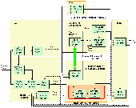
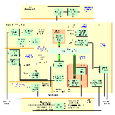

# Pop11 Experiments in Building Emotional Agents

## _Abbott2 and Gridland_

When combined with the [SIM\_AGENT](http://www.cs.bham.ac.uk/~axs/cog_affect/sim_agent.html) toolkit, Pop11 provides an attractive environment for investigating cognitively adequate agent architectures. This web page descibes a series of experiments developed as part of research into "[concern processing in Autonomous Agents](http://www.cs.bham.ac.uk/~sra/Thesis)". This is very much on-going research (with many more ideas described in the thesis still to be tested through the "design-based" approch).

Abbott2 is an extension of work by [Dolores Cañamero](http://www.iiia.csic.es/~lola/) (incorporating ideas from the [Cognition and Affect Project](http://www.cs.bham.ac.uk/research/cogaff/0-INDEX.html) at Buirmingham University). Abbotts are constructed within a subsumption style framework, where more complex behaviours are implemented by adding agents to the society without modifying existing society members. Abbotts are endowed with primitive motivational states - impulses to action based on bodily needs - and �emotions� - peripheral and cognitive responses triggered by the recognition of a significant event. �Emotions� perform an alarm/meta-management function in Abbott, releasing chemicals (hormones, neuromodulators, and neurotransmitters) to alter both the perception of external stimuli and the activation levels of Abbott.s internal motivational drives. The [code](#Code) for Abbott2 is given below.  
 

## _Abbott3_

The main difference between the design of Abbott3 and its predecessors (Abbott and Abbott2), is the absence of a clearly demarcated emotion system (Cañamero.s \[97\] original design called for emotion agents to act as proto-specialists in a similar style to motivation agents). As we argue in chapters 4 and 5 of Allen \[00\], we believe that �emotions� are emergent mental states caused by the interaction of a variable number of intricately connected cognitive systems (i.e. systems that mediate arousal, attention, perception, concepts, memories, and physiological change) operating at different information-processing levels of the brain. Our approach towards elucidating emotions in Abbott3, is to replicate some of these systems at the information-level, and then explore the possible pathways through which emotional states can emerge. The [code](#Code) for Abbott3 is given below.

We have also performed a number of simple experiments using our Abbott3 design and the Gridland toolkit. These experiments are described in chapter 8 of Allen \[00\]. The raw results, and instructions for reproducing these results, can be found [here](abbott/index.html).

## _Papers_

[Allen, S.](http://www.dfki.de/~allen) (2000). A Concern-Centric Society-Of-Mind Approach To Mind Design. In _Proceedings of the AISB'00 Symposium on How To Design A Functioning Mind_. April 2000, Birmingham, England. [Summary PDF (127K)](http://www.cs.bham.ac.uk/~sra/Papers/DAMPosterSummary.pdf), [Summary Postscript (34K)](http://www.cs.bham.ac.uk/~sra/Papers/DAMPosterSummary.ps.gz), [Poster StarOffice A0 (400K)](http://www.cs.bham.ac.uk/~sra/Papers/DAMPosterA0.zip), [Poster PDF A4 (320K)](http://www.cs.bham.ac.uk/~sra/Papers/DAMPosterA4.pdf), [Poster Postscript A4 (230K)](http://www.cs.bham.ac.uk/~sra/Papers/DAMPosterA4.ps.gz)

[Allen, S.](http://www.dfki.de/~allen) (2001). _[Concern Processing in Autonomous Agents](http://www.cs.bham.ac.uk/~sra/Thesis/index.html)_. Submitted PhD Thesis, School of Computer Science, University of Birmingham.

[Cañamero, D.](http://www.iiia.csic.es/~lola/) (1997). Modeling Motivations and Emotions as a Basis for Intelligent Behavior. In _Proceedings of the First International Symposium on Autonomous Agents, AA'97_, Marina del Rey, CA, February 5-8, The ACM Press.  
([http://www.ai.mit.edu/people/lola/aa97-online.ps](http://www.ai.mit.edu/people/lola/aa97-online.ps))  
 

## _Images_

 

|     |     |
| --- | --- |
|  |  |
| Gridland world ([large image 10K](Images/Gridland.gif)) | Gridland Toolkit ([large image 20K](Images/GridlandToolkit.gif)) |
|  |  |
| Abbott2 architecture ([large image 20K](Images/Abbott2.gif)) | Abbott3 architecture ([large image 28K](Images/Abbott3.gif)) |

  
 

## _Code_

Requires [Pop11](http://www.cs.bham.ac.uk/research/projects/poplog/), [OpenMotif](http://www.opennc.org/openmotif/) (or Motif), and the Birmingham Pop11 installation ([rclib](http://www.cs.bham.ac.uk/research/projects/poplog/rclib.tar.gz), [simagent](http://www.cs.bham.ac.uk/research/projects/poplog/sim.tar.gz), [poprulebase](http://www.cs.bham.ac.uk/research/projects/poplog/prb.tar.gz))  
 

|     |     |
| --- | --- |
| **_To Be Updated_ - gzipped tar file** | Code for Experiment 1 - see section 6.2.2 of [thesis](http://www.cs.bham.ac.uk/~sra/Thesis)   (Motivated Control of Behaviour) |
| **_To Be Updated_ - gzipped tar file** | Code for Experiment 2 - see section 6.2.3 of [thesis](http://www.cs.bham.ac.uk/~sra/Thesis)   (Affective Control of Motivation) |
| **[Abbott3 (14/01/2001)](Code/Abbott3_140101.tgz) - gzipped tar file** | Code for Abbott3 - see sections 7 and 8 of [thesis](http://www.cs.bham.ac.uk/~sra/Thesis) |

- - -

  
_Last updated by [Steve Allen](http://www.dfki.de/~allen) 14 January '01_